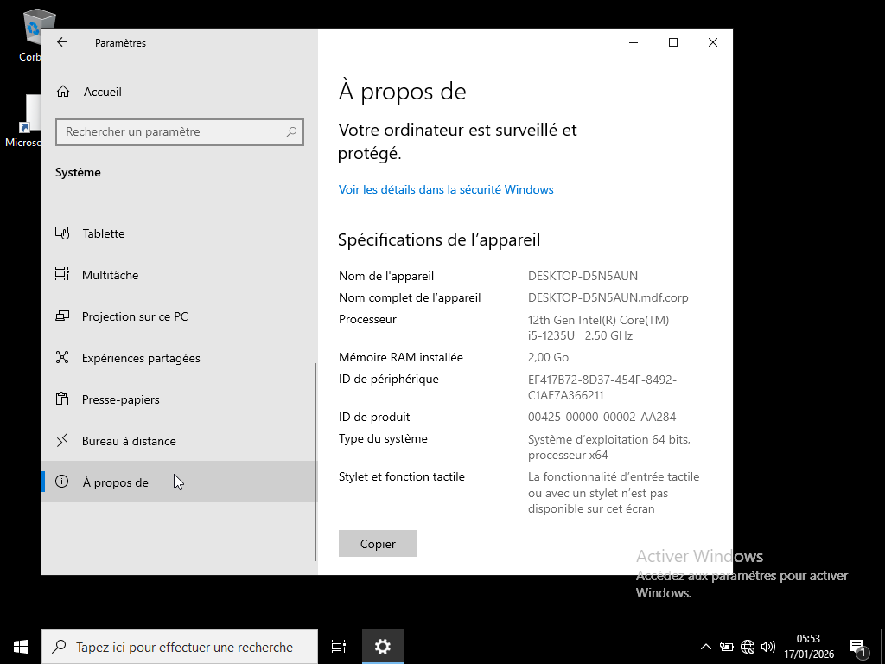
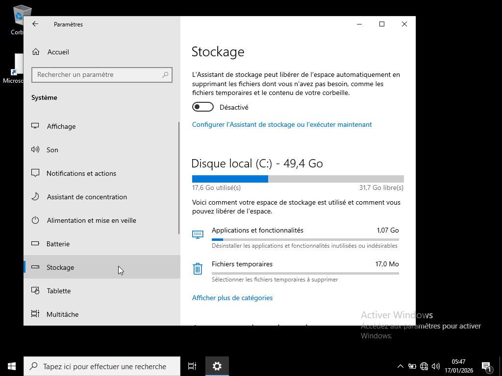
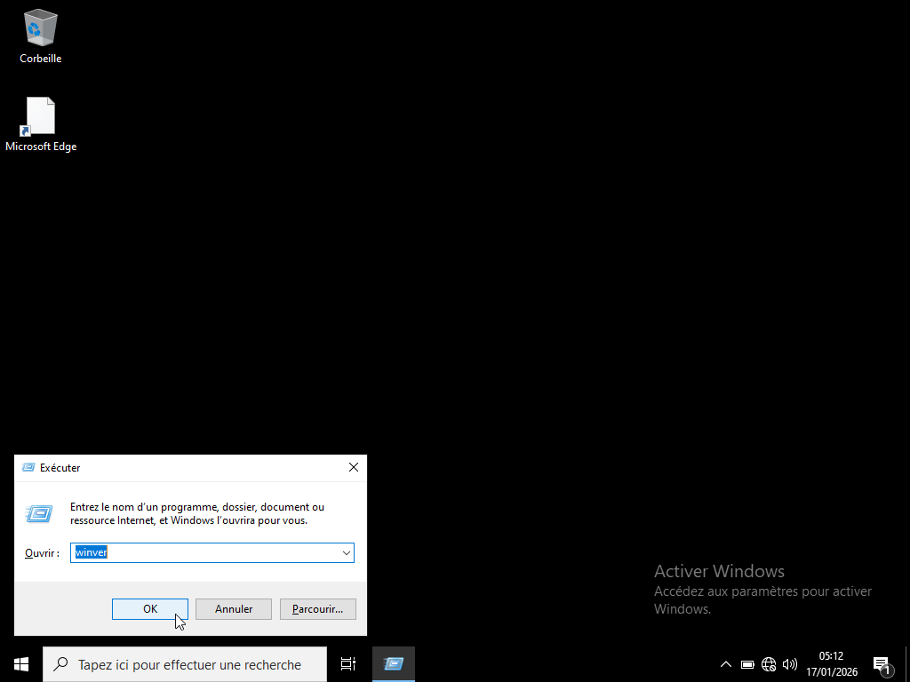

# PROJET 1 : INVENTAIRE DU PARC INFORMATIQUE AVEC GLPI

---

## I. Contexte :

Dans le cadre d’un projet réalisé sur un réseau virtuel, l’organisation ne dispose d’aucun inventaire structuré. Les équipements sont dispersés et les informations ne sont ni centralisées ni mises à jour. Cette situation rend nécessaire la mise en place d’une démarche professionnelle visant à optimiser la gestion des ressources.

---

## II. Objectifs du projet :

Le projet a pour objectifs :

- d’établir un inventaire structuré,

- d'établir un suivi des indicateurs clés de performance,

- de définir et formaliser une politique de sécurité adaptée à l’organisation,

- d’intégrer un outil automatisé de gestion des ressources, tel que GLPI, afin d’optimiser le suivi et la centralisation des informations.

---

## II.1. Inventaire :

## II.1.1. Inventaire Hardware :

L'inventaire Hardware consiste à collecter les données matériels.

| Equipements | Marque  | N° série | Processeur | RAM  | Stockage |         Anomalie            |      Actions recommandées        | Date d'achat | Fin de Garantie |  
|-------------|---------|----------|------------|------|----------|-----------------------------|----------------------------------|--------------|-----------------|
| Ordinateur  |  acer   |    /     | i5-1235U   | 2 GO | 49,4 GO  | RAM et Stockage insuffisant | Remplacement disque, Upgrade RAM | 31/12/2023   |   31/12/2026    |   
| Ordinateur  |  acer   |    /     | i5-1235U   | 2 Go | 49,4 GO  | RAM et Stockage insuffisant | Remplacement disque, Upgrade RAM | 31/12/2024   |   31/12/2027    |
| Serveur     |  acer   |    /     | i5-1235U   | 2 Go | 49,4 GO  | RAM et Stockage insuffisant | Remplacement disque, Upgrade RAM | 31/12/2025   |   31/12/2028    |

## II.1.2. Inventaire Software :

L'inventaire Software consiste à collecter les données logiciels.

|             Logiciel                        |    Licence      | Numéro licence | Utilisateur autorisé | Version  | Date d'expiration | Date de fin de support |                                                                     
|---------------------------------------------|-----------------|----------------|----------------------|----------|-------------------|------------------------|
| Systèmes       | Windows pro 10             |        /        |        /       |        20            |  21H2    |         /         |      13/01/2032        |
| Applicatifs    | Suite Office (Word, Excell)|  Microsoft 365  |        /       |        20            |    /     |    31/12/2026     |          /             |
| Utilitaires    | Duplicati                  |  Open source    |        /       |         2            |    /     |         /         |          /             |
| Développements | Visual Studio code         |  Open source    |        /       |         5            |    /     |         /         |          /             |
| Métiers        | CRM                        |        /        |        /       |        10            |    /     |         /         |          /             |
| Serveurs       | Windows server 22          |        /        |        /       |         2            |  21H2    |         /         |      13/01/2032        |

Contrairement à office (Word, Excelle, etc...) qui a une date d’expiration liée à l’abonnement. Windows Pro ou Windows Server, n'ont pas de fin d'abonnement, on parle plutôt de fin de support en fonction de leur version. Chaque version de Windows a une date de fin de support, après cette date : plus de mises à jour de sécurité, risques de conformité, risques de cybersécurité, obligation de migration dans un SI professionnel.

La date de fin de support d’une version de Windows n’est jamais “devinée” : elle est publiée officiellement par Microsoft. Pour la connaître, il suffit d’identifier la version exacte de Windows et de consulter le tableau de cycle de vie correspondant.

Comment trouvé la version sur Windows ?

Sur le poste ou le serveur taper : Win + R → winver

---

## II.2. Suivi des indicateurs clés de performance :

Un ensemble de collecteurs de données permet d’enregistrer automatiquement les performances d’un poste ou d’un serveur sur une période définie. Grâce à PerfMon, il est possible de créer un suivi personnalisé des indicateurs clés (CPU, mémoire, disque, réseau) et de planifier exécution. Les données collectées peuvent ensuite être analysées pour anticiper les dégradations et proposer des actions de maintenance préventive.

Étapes à suivre : 

1. Ouvrir PerfMon 

Touche Windows → taper perfmon → Entrer 

2. Accéder à “Ensembles de collecteurs de données” 

Dans le volet gauche : Surveillance des performances → Ensembles de collecteurs de données → clic droit sur Défini par l’utilisateur → Nouveau → Ensemble de collecteurs de données 

3. Nommer l’ensemble 

Donner un nom explicite (ex : Suivi_1_semaine_PC01) 
Choisir Créer manuellement (avancé) → Suivant

4. Ajouter des collecteurs 

Choisir Données de performances → Suivant 

Cliquer sur Ajouter → sélectionner les compteurs souhaités : 

5. Définir l’emplacement d’enregistrement 

Choisir un dossier (ex : C:\PerfLogs\Suivi_PC01)

6. Définir le mode d’exécution 

Choisir Enregistrer et fermer 

Planifier l’exécution :

1. Dans Défini par l’utilisateur, clic droit sur ton ensemble → Propriétés 

2. Onglet Planification : 

Activer la planification 

Définir la date de début 

 
---

## II.3. Politique de sécurité :

La Politique de Sécurité des Systèmes d’Information (PSSI) définit les règles permettant d’assurer la confidentialité, l’intégrité et la disponibilité des données et services informatiques de l’organisation MDF.

## Principes généraux :

- La sécurité est l’affaire de tous les utilisateurs.

- Toute action doit respecter les lois en vigueur (RGPD, propriété intellectuelle).

- Les accès sont attribués selon le principe du moindre privilège.

- Les données sensibles doivent être protégées contre toute divulgation non autorisée.

## Gestion des comptes et habilitations :

- Chaque utilisateur dispose d’un compte nominatif.

- Les droits sont attribués via le modèle AGDLP.

- Les comptes administrateurs sont strictement réservés au personnel IT.

- Les comptes inactifs sont désactivés après 30 jours.

## Gestion des mots de passe :

- Longueur minimale : 12 caractères.

- Complexité obligatoire (majuscules, minuscules, chiffres, caractères spéciaux).

- Renouvellement tous les 90 jours.

- Interdiction de partager un mot de passe.

## Sauvegardes :

- Sauvegarde quotidienne des serveurs critiques.

- Conservation 30 jours.

- Tests de restauration trimestriels.

## Postes de travail :

- Verrouillage automatique après 10 minutes.

- Installation de logiciels interdite sans validation IT.

- Antivirus obligatoire.

## Réseau :

- Segmentation par VLAN.

- Filtrage via firewall Fortinet.

- Wi‑Fi invité isolé du réseau interne.

