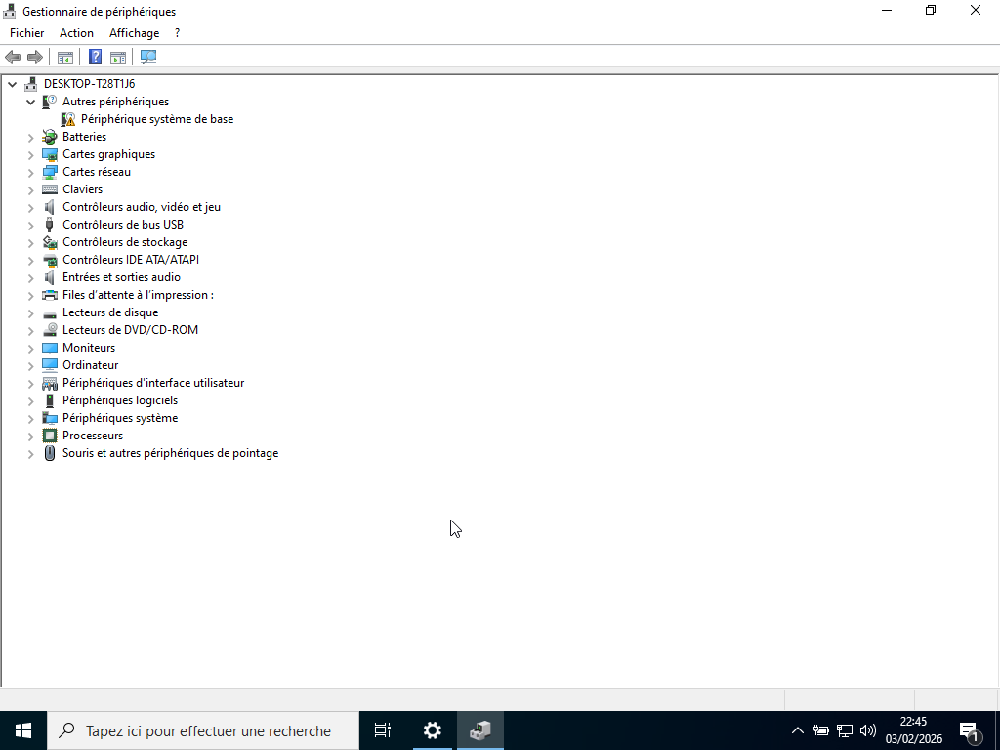
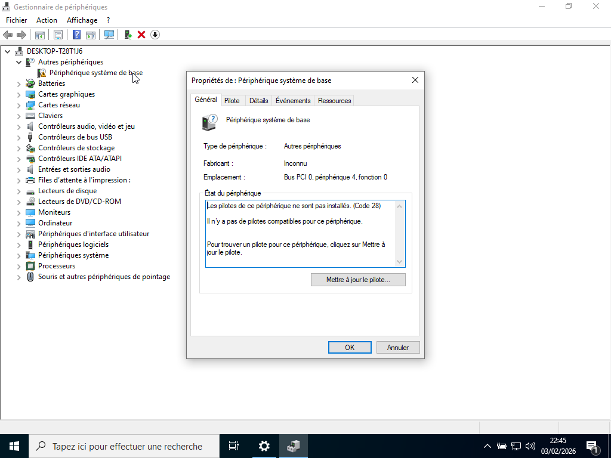

# PROJET 1 : INVENTAIRE INTRANET PARC INFORMATIQUE

---

## I. Introduction :

Dans le cadre de la gestion d’un parc informatique, il est essentiel pour une organisation de disposer d’une vision précise et centralisée de l’ensemble de ses équipements. Pour répondre à cet enjeu, j’ai mis en place une solution d’inventaire automatisé au sein d’un réseau intranet, permettant de collecter et de remonter les informations matérielles et logicielles d'un poste utilisateur vers un serveur centralisé.

Ce projet repose sur l’installation d’un serveur GLPI hébergé en local, ainsi que sur le déploiement de l’agent GLPI sur le poste du réseau. L’utilisation de l’intranet garantit un environnement sécurisé, rapide et totalement maîtrisé, sans dépendance à Internet. L’objectif est d’automatiser l’inventaire, de fiabiliser les données du parc et de faciliter le travail du support informatique grâce à une base d’informations toujours à jour.

Cette solution permet à l’entreprise d’améliorer la maintenance, d’optimiser le suivi du matériel et de renforcer la traçabilité des équipements, tout en s’intégrant parfaitement dans les bonnes pratiques de gestion informatique.

---

## II. Problématique :

Dans un contexte où le parc informatique évolue constamment, l’entreprise doit disposer d’une vision fiable et centralisée de ses équipements pour assurer une maintenance efficace et une gestion optimale des ressources. Or, sans outil d’inventaire automatisé, les informations matérielles et logicielles deviennent rapidement obsolètes, ce qui complique le suivi des postes, augmente les risques d’incidents et ralentit le support technique.
La problématique est donc la suivante : comment mettre en place une solution d’inventaire automatisée, sécurisée et accessible via l’intranet, permettant de collecter et d’actualiser en continu les données du parc informatique ?

---

## III. Objectifs :

La mise en place d’un inventaire automatisé en intranet poursuit plusieurs objectifs essentiels pour la gestion du parc informatique :

1. Centraliser l’ensemble des informations du parc
Rassembler dans une base unique toutes les données matérielles et logicielles des postes de travail afin de disposer d’une vision globale, fiable et constamment à jour.

2. Automatiser la collecte des inventaires
Éliminer les relevés manuels, sources d’erreurs et de perte de temps, en déployant un agent capable d’envoyer automatiquement les informations vers le serveur GLPI.

3. Améliorer la maintenance et le support
Faciliter le diagnostic des incidents, anticiper les pannes et optimiser les interventions grâce à des fiches machines complètes et actualisées.

4. Renforcer la traçabilité et le suivi du matériel
Assurer un suivi précis du cycle de vie des équipements : installation, affectation, mises à jour, remplacement.

5. Sécuriser les échanges en restant dans un environnement intranet
Garantir que toutes les communications entre les agents et le serveur GLPI se font dans un réseau interne maîtrisé, sans exposition à Internet.

6. Optimiser la gestion des licences et des ressources
Identifier les logiciels installés, vérifier leur conformité et mieux planifier les achats ou renouvellements.

---

## IV. Enjeux :

La mise en place d’un inventaire automatisé au sein de l’intranet représente un enjeu stratégique pour la gestion du parc informatique. Elle permet d’améliorer la fiabilité des informations, de renforcer la sécurité du système d’information et d’optimiser les ressources matérielles et logicielles.
L’enjeu principal est de garantir une maîtrise complète du parc informatique, en disposant de données centralisées, actualisées et accessibles uniquement depuis un environnement interne sécurisé.

Sur le plan opérationnel, ce projet vise à réduire les interventions manuelles, limiter les erreurs de saisie et faciliter le travail des équipes techniques grâce à une meilleure visibilité sur l’état des équipements.
Sur le plan organisationnel, il contribue à optimiser les coûts, à anticiper les besoins de renouvellement et à assurer la conformité des logiciels installés.
Enfin, sur le plan sécuritaire, l’utilisation de l’intranet permet de protéger les échanges de données sensibles, en évitant toute exposition du serveur GLPI sur Internet.

---

## V. Déroulement :

Le projet d’inventaire intranet s’est déroulé en plusieurs phases successives, permettant une mise en place progressive, testée et maîtrisée de la solution. Chaque étape a été réalisée de manière méthodique afin d’assurer la fiabilité du système et la cohérence des données collectées.

1. Préparation de l’environnement technique

2. Configuration de GLPI et activation de l’inventaire

3. Installation et paramétrage de l’agent GLPI sur les postes

4. Tests de remontée et validation des données

---

## V.1. Préparation de l'environnement technique :

Dans certaines entreprises, la configuration d'un nouveau poste peut être automatisé avec un serveur de déploiement par exemple, mais la plupart des entreprises n'ont pas forcement les compétences en interne ou l'infrastructure nécessaire à la mise en place d'un tel dispositif.

Dans ce cadre là, un cahier des charges est une alternative intéressante : l'idée consiste à mettre en place une liste de toutes les taches à effectuer lors de chaque configuration d'un nouveau poste. Une telle liste offre de nombreux avantages, par exemple le fait que n'importe qu'elle personne de l'entreprise puisse s'y référer en cas d'indisponibilité du responsable ainsi que l'assurance de n'oublier aucune étape.

## Cahier de charge essentiel :

- Installation ou réinstallation de Windows
- Activation de Windows
- Installation des mises à jours
- Installation d'un antivirus
- Installation des nouveaux périphériques
- Diagnostic de tout problème matériel

## 1. Installation de Windows

## 2. Installation des mises à jour

Dans la grande majorité des cas, les mises à jour nécessitent une connexion Internet, mais il existe quelques nuances importantes selon le type de mise à jour et l’environnement dans lequel on travaille.

- Mises à jour classiques (Windows Update)

Pour un poste standard (Windows 10 / 11), les mises à jour proviennent directement des serveurs Microsoft. Elles nécessitent une connexion Internet pour : télécharger les correctifs de sécurité, récupérer les mises à jour de fonctionnalités, mettre à jour les pilotes certifiés, installer les définitions antivirus (Microsoft Defender).

- En entreprise (WSUS, SCCM, MDT)

Dans un réseau professionnel, les mises à jour peuvent être distribuées depuis un serveur interne. 

Par exemple : 

- WSUS (Windows Server Update Services),
- SCCM / MECM,
- MDT (Microsoft Deployment Toolkit),
- Serveur de déploiement FOG.

Dans ce cas, le poste client n’a pas besoin d’Internet, c’est le serveur interne qui télécharge les mises à jour depuis Internet tandis que les postes récupèrent les mises à jour en intranet.

- Mises à jour hors‑ligne (cas particuliers)

Il existe des méthodes pour mettre à jour un poste sans Internet. 

Par exemples : 

- Télécharger les mises à jour sur une autre machine,
- Les mettre sur une clé USB, 
- Utiliser un pack hors‑ligne (ex : WSUS Offline Update).

## 3. Installation d'un antivirus

La plupart des entreprises disposent d'une licence pour un antivirus. Si tel est le cas, c'est vers celui là qu'il faudra se diriger. Si ce n'est pas le cas, l'installation d'un antivirus gratuit, tel qu'Avast, Kaspersky ou AVG peut être envisagée.

## 4. Installation des nouveaux périphériques

Il est courant de se retrouver avec des périphériques non reconnus lors d'une nouvelle installation de Windows. Il est important de résoudre tous les problèmes des la première configuration du système afin que le futur installateur ne rencontre aucune difficulté par la suite.

## 5. Diagnostic de tous problèmes matériels

