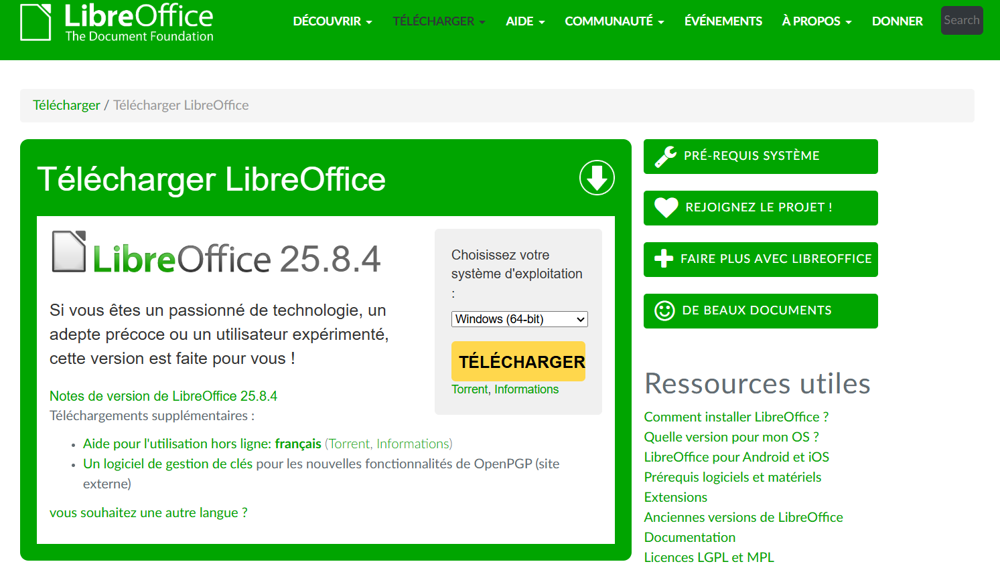
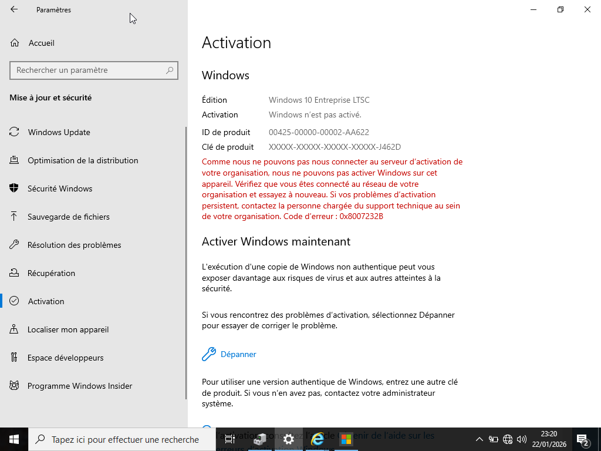

# PROJET 1 : INVENTAIRE PARC INFORMATIQUE

---

## I. Contexte :

Dans le cadre d’un projet réalisé pour une entreprise du nom de MDF sur un réseau virtuel, l’organisation ne dispose d’aucun inventaire structuré. Les équipements sont dispersés et les informations utilisateurs ne sont ni centralisées ni mises à jour. Cette situation rend nécessaire la mise en place d’une démarche professionnelle visant à optimiser la gestion des ressources de l'entreprise.

---

## II. Objectifs du projet :

Le projet a pour objectifs :

- d’établir un inventaire structuré,

- de réaliser un suivi des indicateurs clés des performances,

- de définir et formaliser une politique de sécurité adaptée à l’organisation,

- d’intégrer un outil automatisé de gestion des ressources, tel que GLPI, afin d’optimiser le suivi et la centralisation des informations.

---

## II.1. Inventaire :

## II.1.1. Inventaire Hardware :

L'inventaire Hardware consiste à collecter les données matériels.

| Postes  | Marques | Modèles            | Processeur | RAM  | Carte graphique | Stockage | Périphériques   |
|---------|---------|--------------------|------------|------|-----------------|----------|-----------------|
| PC fixe | Dell    | Optiplex 7070      | Intel i5   | 2 Go |       /         |  50 GB   | Souris, Clavier | 
| Laptop  | Lenovo  | ThinkPad X1 Carbon | Intel i5   | 2 Go |       /         |  50 GB   |        /        | 
| PC fixe | HP      | ProDesk 400 G6     | Intel i5   | 2 Go |       /         |  50 GB   | Souris, Clavier | 
| PC fixe | Dell    | Optiplex 7070      | Intel i5   | 2 Go |       /         |  50 GB   | Souris, Clavier | 
| Laptop  | Lenovo  | ThinkPad X1 Carbon | Intel i5   | 2 Go |       /         |  50 GB   |       /         | 
| PC fixe | HP      | ProDesk 400 G6     | Intel i5   | 2 Go |       /         |  50 GB   | Souris, Clavier | 
| PC fixe | Dell    | Optiplex 7070      | Intel i5   | 2 Go |       /         |  50 GB   | Souris, Clavier | 
| Laptop  | Lenovo  | ThinkPad X1 Carbon | Intel i5   | 2 Go |       /         |  50 GB   |      /          |

                                                                       

                                                                    

---

## Explication :

GPU est un processeur spécialisé dans le traitement graphique.

Si Windows affiche Aucun GPU installé, cela veut dire qu'il y a de GPU réel.

Cela arrive uniquement :

- si le processeur n’a pas de GPU intégré  

- s'il n'y a pas de carte graphique dédiée.

#### Dans ce cas :

- windows utilise un pilote d’affichage basique

- l’affichage fonctionne, mais très limité

- pas d’accélération graphique

- performances faibles mais suffisantes pour afficher le bureau.

#### Il est possible d'utiliser :

- bureautique (Word, Excel, PDF)

- navigation Internet

- youTube / Netflix

- gestion de fichiers

- logiciels légers (GLPI, VirtualBox, Github, CRM).

---

## II.1.2. Inventaire Software : 

L'inventaire Software consiste à collecter les données logiciels.

| Types de Logiciels | Logiciels          | Licences    | Expiration | Version | Fin de support |
|--------------------|--------------------|-------------|------------|---------|----------------|
| Systèmes           | Windows pro 10     |      /      |    /       |   21H2  |   13/01/2032   |
| Applicatifs        | Libre Office       | Open source |    /       |     /   |       /        |
| Développements     | Visual Studio code | Open source |    /       |     /   |       /        |
| Métiers            | CRM                |      /      |    /       |     /   |       /        |
| Serveurs           | Windows server 22  |      /      |    /       |   21H2  |   13/01/2032   |

---

## II.1.3. Inventaire Globale : 
 
| N° | Code | Postes   | Marques |             Logiciels                  | Processeur | RAM  | Stockage | Périphériques   |   Etats       | Services     | Localisation |
|----|------|----------|---------|----------------------------------------|------------|------|----------|-----------------|---------------|--------------|--------------|
| 1  | PC01 | PC fixe  | Dell    | Windows pro 10, Libre Office           | Intel i5   | 2 Go |  50 GB   | Souris, Clavier |  En service   | Direction    |   Bureau 1   |
| 2  | PC02 | Laptop   | Lenovo  | Windows pro 10, Libre Office           | Intel i5   | 2 Go |  50 GB   |        /        |  En service   | RH           |   Bureau 1   |
| 3  | PC03 | PC fixe  | HP      | Windows pro 10, Libre Office           | Intel i5   | 2 Go |  50 GB   | Souris, Clavier |  En service   | Production   |   Bureau 2   |
| 4  | PC04 | PC fixe  | Dell    | Windows pro 10, Libre Office, CRM      | Intel i5   | 2 Go |  50 GB   | Souris, Clavier |  En service   | Commercial   |   Bureau 2   |
| 5  | PC05 | Laptop   | Lenovo  | CRM, Visual studio code                | Intel i5   | 2 Go |  50 GB   |        /        |  En service   | Comptabilité |   Bureau 3   | 
| 6  | PC06 | PC fixe  | HP      | Windows pro 10,  Visual studio code    | Intel i5   | 2 Go |  50 GB   | Souris, Clavier |  En service   | Informatique |   Bureau 4   |
| 7  | PC07 | PC fixe  | Dell    | Windows pro 10, Libre Office, CRM      | Intel i5   | 2 Go |  50 GB   | Souris, Clavier |  En service   | Marketing    |   Bureau 3   |
| 8  | PC08 | Laptop   | Lenovo  | Windows server 22                      | Intel i5   | 2 Go |  50 GB   |        /        |  En service   | Informatique |   Bureau 4   |
                                                                                           
---

## II.2. Suivi des indicateurs clés des performances :

---

## Conclusion sur le suivi : 

Le fait que Windows 10 Enterprise LTSC ne soit pas activé peut indirectement empêcher l’installation automatique de certains pilotes, surtout dans une machine virtuelle. Windows non activé limite certaines fonctionnalités, notamment : Personnalisation, Accès complet à Windows Update, Téléchargement de pilotes facultatifs ou tiers.

Certains périphériques, comme les contrôleurs PCI virtuels, restent non reconnus car Windows ne télécharge pas leur pilote automatiquement.

---

## Solution proposé au suivi :

Activer une clé MAK ou une clé KMS.

#### Pour rappel :
Une clé MAK est une clé de produit Windows utilisée dans les entreprises pour activer définitivement un certain nombre de machines. 
Fonctionnement : 
- elle active Windows une seule fois par machine, 
- l’activation se fait via Internet directement auprès de Microsoft, 
- une fois activé, le PC reste activé à vie, même hors réseau.

Une clé KMS est une clé utilisée pour activer Windows via un serveur d’activation interne dans une organisation. 
Fonctionnement :
- le PC contacte un serveur KMS interne, 
- l’activation est temporaire : 180 jours, 
- le PC doit renouveler son activation régulièrement en restant sur le réseau de l’entreprise.

---

## II.4 Politique de sécurité :

La Politique de Sécurité des Systèmes d’Information (PSSI) définit les règles permettant d’assurer la confidentialité, l’intégrité et la disponibilité des données et services informatiques de l’organisation MDF.

### Principes généraux :

- La sécurité est l’affaire de tous les utilisateurs.

- Toute action doit respecter les lois en vigueur (RGPD, propriété intellectuelle).

- Les accès sont attribués selon le principe du moindre privilège.

- Les données sensibles doivent être protégées contre toute divulgation non autorisée.

### Gestion des comptes et habilitations :

- Chaque utilisateur dispose d’un compte nominatif.

- Les droits sont attribués via le modèle AGDLP.

- Les comptes administrateurs sont strictement réservés au personnel IT.

- Les comptes inactifs sont désactivés après 30 jours.

### Gestion des mots de passe :

- Longueur minimale : 12 caractères.

- Complexité obligatoire (majuscules, minuscules, chiffres, caractères spéciaux).

- Renouvellement tous les 90 jours.

- Interdiction de partager un mot de passe.

### Sauvegardes :

- Sauvegarde quotidienne des serveurs critiques.

- Conservation 30 jours.

- Tests de restauration trimestriels.

### Postes de travail :

- Verrouillage automatique après 10 minutes.

- Installation de logiciels interdite sans validation IT.

- Windows Defender Antivirus obligatoire.

### Réseau :

- Segmentation par VLAN.

- Filtrage via firewall Fortinet.

- Wi‑Fi invité isolé du réseau interne.

---

## II.5. Automatisé la gestion avec GLPI :

GLPI est un logiciel libre de gestion informatique (ITSM) qui permet de gérer un parc informatique, les utilisateurs, les tickets d’assistance et l’ensemble des services IT d’une organisation. C’est l’un des outils les plus utilisés en France pour inventorier, suivre et administrer un système d’information.

### II.5.1 Installation de GLPI :

