# PROJET 3 : INVENTAIRE PARC INFORMATIQUE

---

## I. Contexte :

Dans la continuité de mon projet 1 réalisé sur un environnement virtuel, l’organisation MDF ne dispose d’aucun inventaire structuré. Les équipements sont dispersés et les informations utilisateurs ne sont ni centralisées ni mises à jour. Cette situation rend nécessaire la mise en place d’une démarche professionnelle visant à optimiser la gestion des ressources de l'entreprise.

---

## II. Objectifs du projet :

Le projet a pour objectifs :

- d’établir un inventaire structuré,
- de réaliser un diagnostic du système,
- de définir une politique de sécurité adaptée à l’organisation,
- d’intégrer un outil automatisé GLPI.

---

## II.1. Inventaire :

## II.1.1. Inventaire Hardware :

L'inventaire Hardware consiste à collecter les données matériels.

| N° | Code     | Postes   | Marques        | Modèles    | N° de série                                       | CPU       | RAM  | Stockage | 
|----|----------|----------|----------------|------------|---------------------------------------------------|-----------|------|----------|
| 1  | SRV-AD   | Portable | innotek GmbH   | VirtuelBox | VirtuelBox-b9835393-e1a5-4857-9b6b-97f2698c9b14   | Intel i5  | 2 Go |  50 GB   |  
| 2  | SRV-GLPI | Portable | innotek GmbH   | VirtuelBox | VirtuelBox-888e8ced-feso-4e5d-8b5d-31fa7afd31ff   | Intel i5  | 2 Go |  50 GB   | 
| 3  | PC01     | Portable | innotek Gmbh   | VirtuelBox | VirtuelBox-8b199364-B669-49e4-8303-913e1987b5b9   | Intel i5  | 2 Go |  50 GB   | 
| 4  | PC02     | Portable | innotek GmbH   | VirtuelBox | VirtuelBox-                                       | Intel i5  | 2 Go |  50 GB   |        
| 5  | PC03     | Portable | innotek GmbH   | VirtuelBox | VirtuelBox-                                       | Intel i5  | 2 Go |  50 GB   |        

 
                                                                  
 
                                                              

 

                                                          
## II.1.2. Inventaire Software : 

L'inventaire Software consiste à collecter les données logiciels.

| Types de Logiciels | Logiciels                     | Licences    | N° de Licence | Expiration | Version | Fin de support |
|--------------------|-------------------------------|-------------|---------------|------------|---------|----------------|
| Systèmes           | Windows pro 10                |      /      |       /       |     /      |   21H2  |   13/01/2032   |
| Développements     | Visual Studio code            | Open source |       /       |     /      |     /   |       /        |
| Métiers            | CRM                           |      /      |       /       |     /      |     /   |       /        |
| Serveurs           | Windows server 22, WampServer |      /      |       /       |     /      |   21H2  |   13/01/2032   |

## II.1.3. Inventaire Globale : 
 
| N° | Code     | Postes   | Marques      |             Logiciels                           | CPU       | RAM  | Stockage | Etats      | Services         | Lieu |
|----|----------|----------|--------------|-------------------------------------------------|-----------|------|----------|------------|------------------|------|
| 1  | SRV-AD   | Portable | innotek GmbH | Windows server 22                               | Intel i5  | 2 Go |  50 GB   | En service | /                | B1   |
| 2  | SRV-GLPI | Portable | innotek GmbH | Windows pro 10, WampServer                      | Intel i5  | 2 Go |  50 GB   | En service | /                | B1   |
| 3  | PC01     | Portable | innotek GmbH | Windows pro 10, WampServer, Visuel Studio code  | Intel i5  | 2 Go |  50 GB   | En service | Informatique (IT)| B2   |
| 4  | PC02     | Portable | innotek GmbH | Windows pro 10, CRM                             | Intel i5  | 2 Go |  50 GB   | En service | Comptabilité     | B2   |
| 5  | PC03     | Portable | innotek Gmbh | Windows pro 10, CRM                             | Intel i5  | 2 Go |  50 GB   | En service | Marketing        | B2   |                                                                                           

---

## II.2. Diagnostic du système :

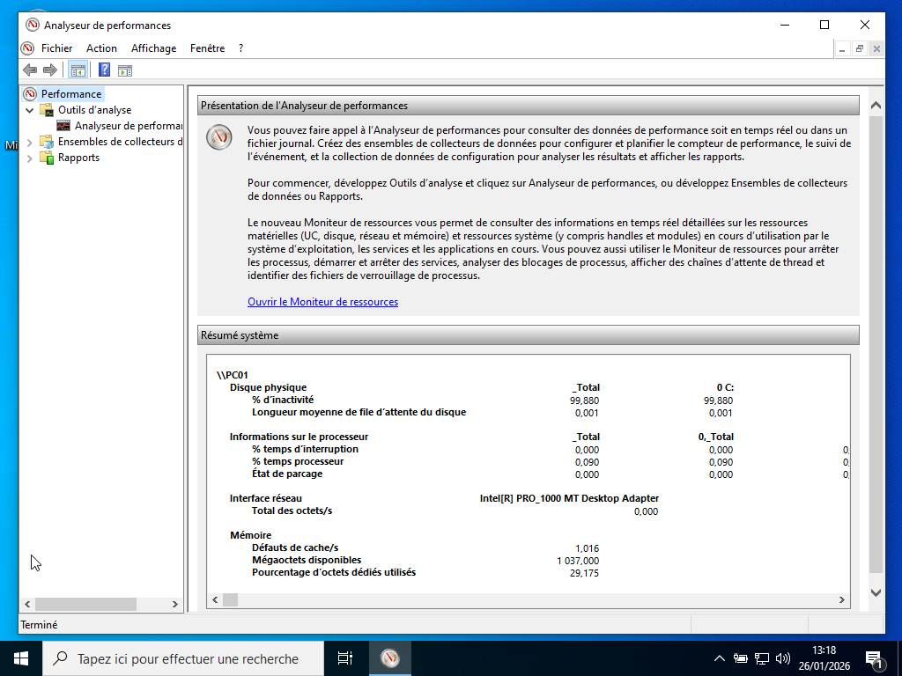

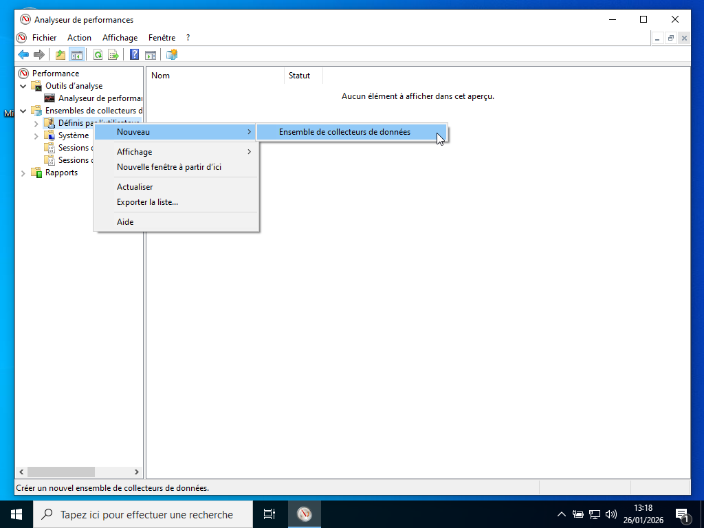

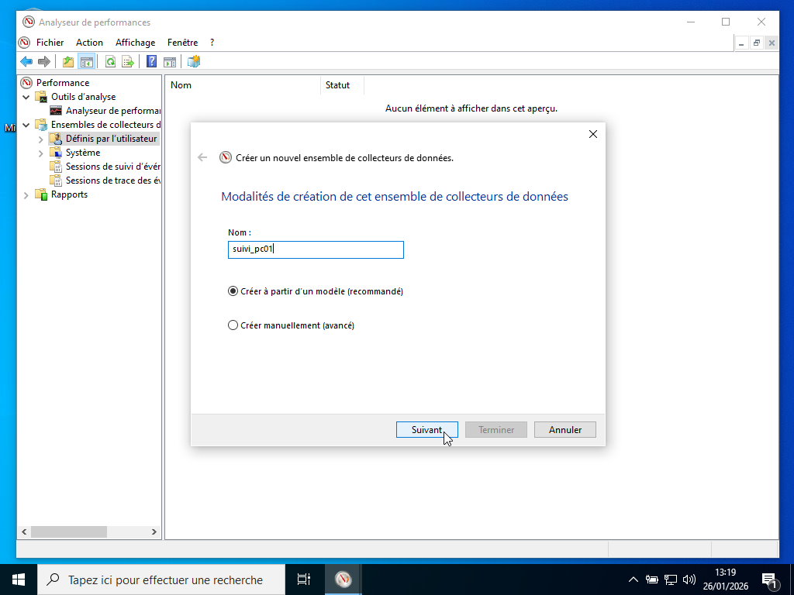

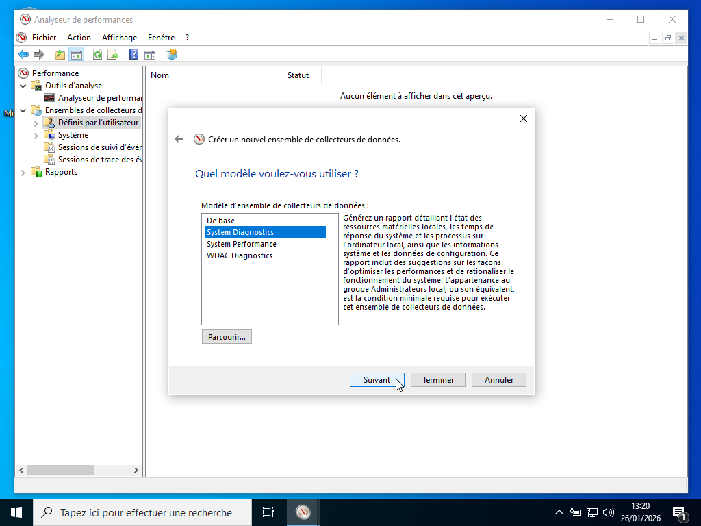

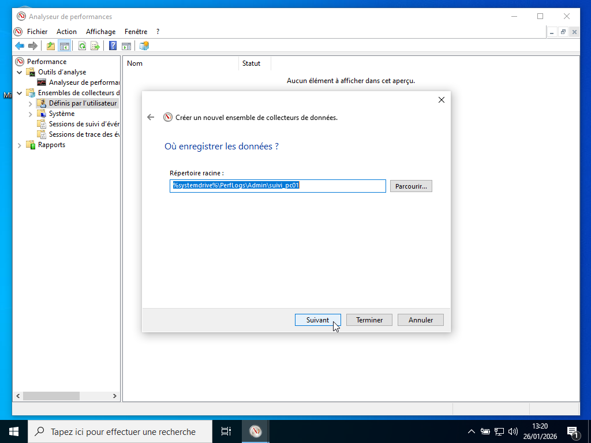

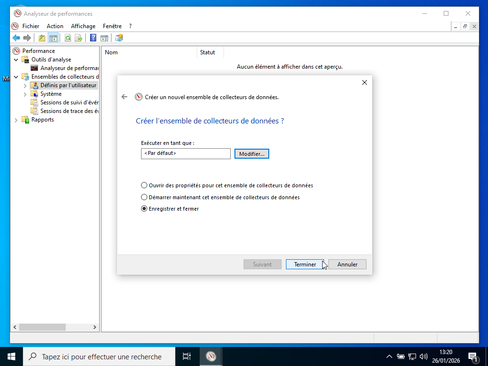

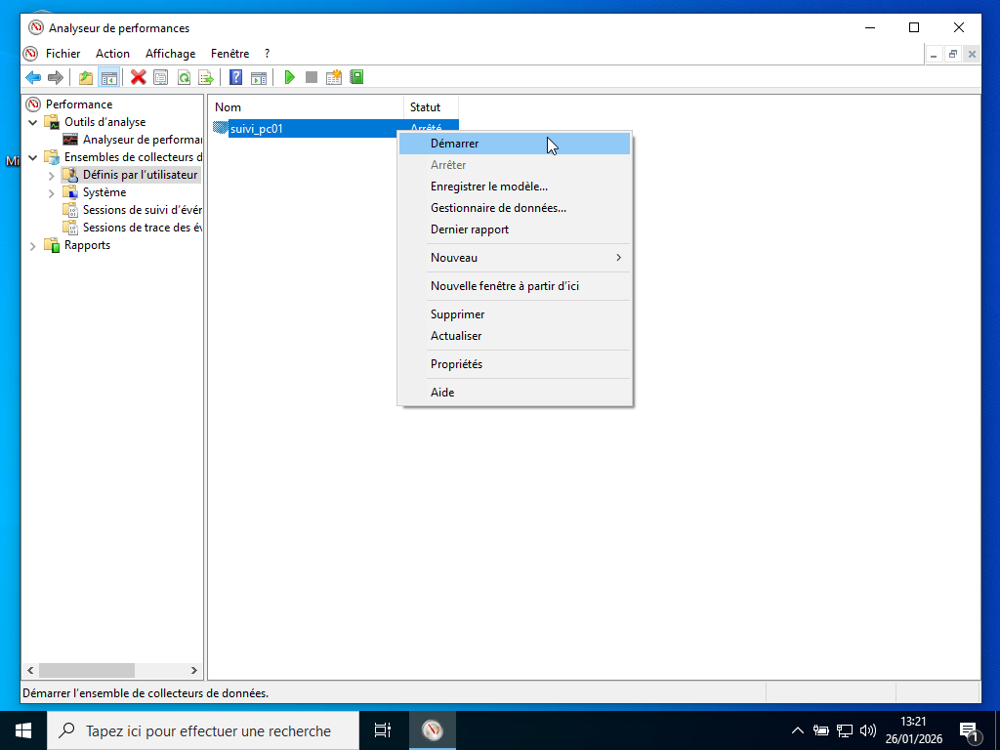

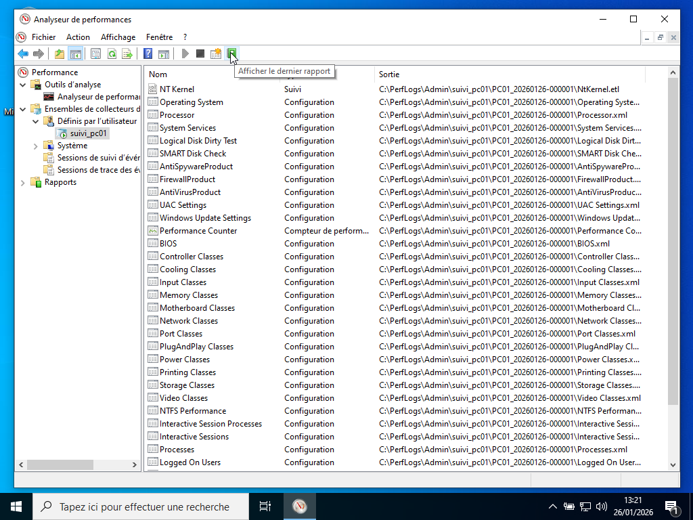

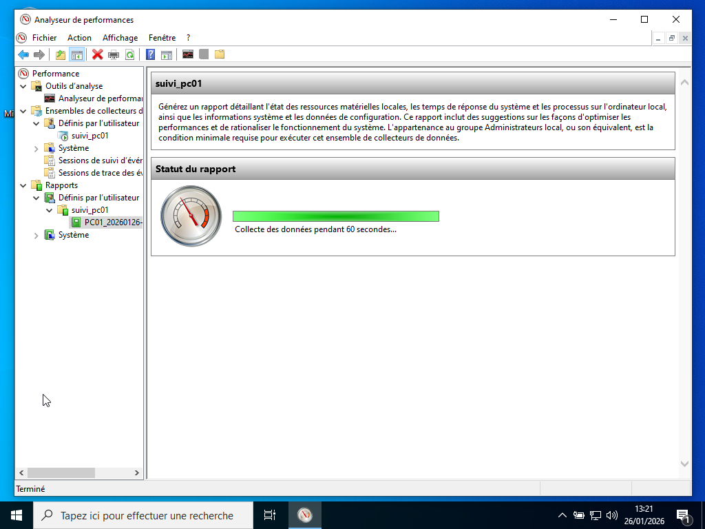

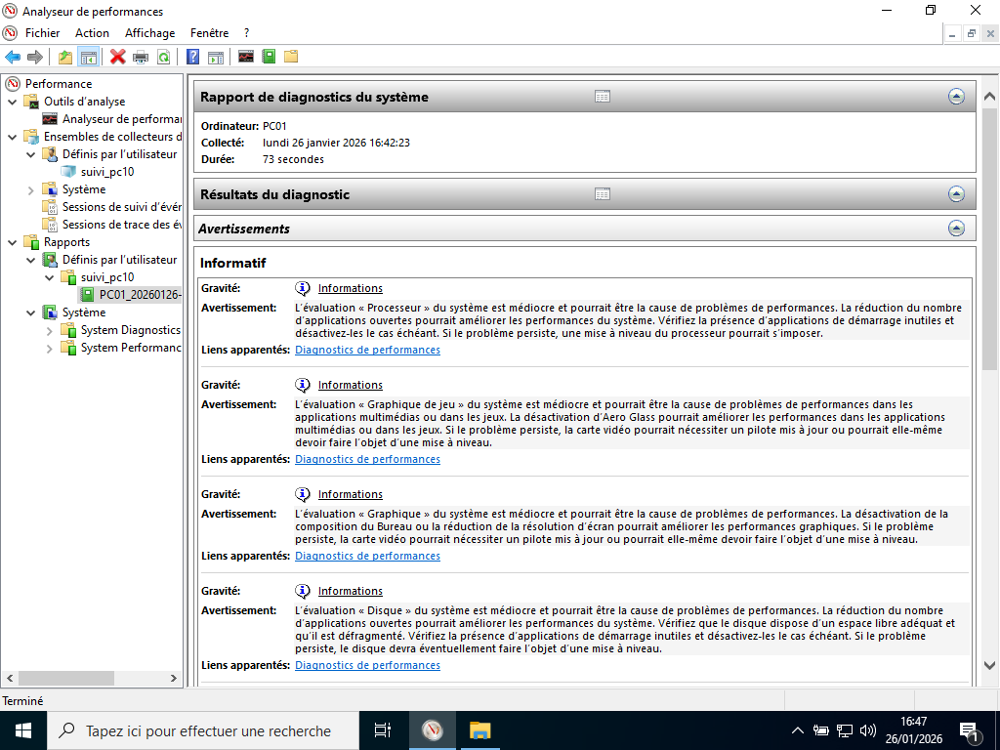

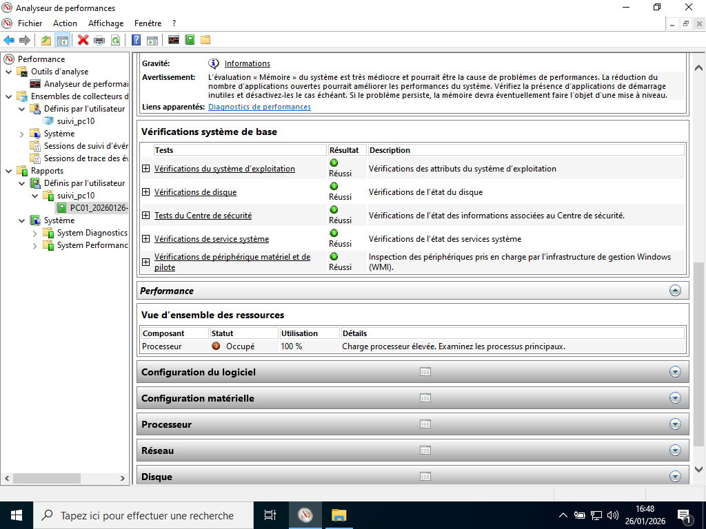

---

## II.3. Politique de sécurité :

La Politique de Sécurité des Systèmes d’Information (PSSI) définit les règles permettant d’assurer la confidentialité, l’intégrité et la disponibilité des données et services informatiques de l’organisation.

### Principes généraux :

- La sécurité est l’affaire de tous les utilisateurs.
- Toute action doit respecter les lois en vigueur (RGPD, propriété intellectuelle).
- Les accès sont attribués selon le principe du moindre privilège.
- Les données sensibles doivent être protégées contre toute divulgation non autorisée.

### Gestion des comptes et habilitations :

- Chaque utilisateur dispose d’un compte nominatif.
- Les droits sont attribués via le modèle AGDLP.
- Les comptes administrateurs sont strictement réservés au personnel IT.
- Les comptes inactifs sont désactivés après 30 jours.

### Gestion des mots de passe :

- Longueur minimale : 12 caractères.
- Complexité obligatoire (majuscules, minuscules, chiffres, caractères spéciaux).
- Renouvellement tous les 90 jours.
- Interdiction de partager un mot de passe.

### Sauvegardes :

- Sauvegarde quotidienne des serveurs critiques.
- Conservation 30 jours.
- Tests de restauration trimestriels.

### Postes de travail :

- Verrouillage automatique après 10 minutes.
- Installation de logiciels interdite sans validation IT.
- Windows Defender Antivirus obligatoire.

### Réseau :

- Segmentation par VLAN.
- Filtrage via firewall Fortinet.

---

## II.4. Automatisation de la gestion avec GLPI :

Prérequis à télécharger :

- WampServer (PHP version 7.4.33) 
- Packages Microsoft Visual C++ 
- GLPI version 10.0.6
- Agent GLPI. 

## Installation WampServer :

WampServer est une plateforme de développement web pour Windows. Elle permet : de créer et tester des sites web en local, d'utiliser des technologies comme (Apache, MySQL, PHP), de gérer les bases de données avec phpMyAdmin.

## Installation GLPI :

GLPI est un logiciel libre de gestion informatique (ITSM) qui permet de gérer : un parc informatique, les utilisateurs, les tickets d’assistance et l’ensemble des services IT d’une organisation. GLPI permet d’appliquer concrètement les processus ITIL dans une organisation. 

ITIL (Information Technology Infrastructure Library) est un référentiel international qui décrit les meilleures pratiques pour organiser un service informatique. Il définit des processus tels que : gestion des incidents, gestion des demandes, gestion des problèmes, gestion des changements, gestion des actifs (CMDB), gestion des connaissances, gestion du catalogue de services, suivi des SLA et qualité de service.

